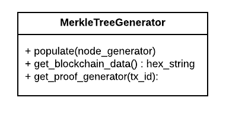
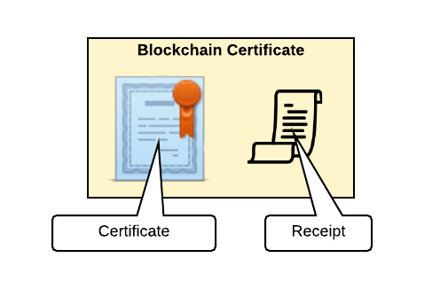

[](https://travis-ci.org/blockchain-certificates/cert-issuer)
[](https://badge.fury.io/py/cert-issuer)


# cert-issuer

The cert-issuer project issues blockchain certificates by creating a transaction from the issuing institution to the
recipient on the Bitcoin blockchain that includes the hash of the certificate itself. 

## Web resources
For development or testing using web requests, check out the documentation at [docs/web_resources.md](./docs/web_resources.md).

# Quick start using Docker

## Getting the Docker image
This uses bitcoind in regtest mode. This route makes many simplifications to allow a quick start, and is intended for
experimenting only.

1. First ensure you have Docker installed. [See our Docker installation help](docs/docker_install.md).

2. Clone the repo and change to the directory

    ```
    git clone https://github.com/blockchain-certificates/cert-issuer.git && cd cert-issuer
    ```


3. From a command line in cert-issuer dir, build your docker container:
    
    ```
    docker build -t bc/cert-issuer:1.0 .
    ```

4. Read before running!

    - Once you launch the docker container, you will make some changes using your personal issuing information. This flow mirrors what you would if you were issuing real certificates.
    - To avoid losing your work, you should create snapshots of your docker container. You can do this by running:

        ```
        docker ps -l
        docker commit <container for your bc/cert-issuer> my_cert_issuer
        ```

5. When you're ready to run:

    ```
    docker run -it bc/cert-issuer:1.0 bash
    ```

## Create issuing address

__Important__: this is a simplification to avoid using a USB, which needs to be inserted and removed during the
standard certficate issuing process. Do not use these addresses or private keys for anything other than experimenting.

Ensure your docker image is running and bitcoind process is started

1. Create an 'issuing address' and save the output as follows:

    ```
    issuer=`bitcoin-cli getnewaddress`
    sed -i.bak "s/<issuing-address>/$issuer/g" /etc/cert-issuer/conf.ini
    bitcoin-cli dumpprivkey $issuer > /etc/cert-issuer/pk_issuer.txt
    ```
    
2. Don't forget to save snapshots so you don't lose your work (see step 3 of client setup)

## Issuing certificates

1. Add your certificate to /etc/cert-issuer/data/unsigned_certificates/. 

    ```
    # To use a sample unsigned certificate as follows:
    cp /cert-issuer/examples/data-testnet/unsigned_certificates/3bc1a96a-3501-46ed-8f75-49612bbac257.json /etc/cert-issuer/data/unsigned_certificates/ 
    
    # If you created your own unsigned certificate using cert-tools (assuming you placed it under data/unsigned_certificates):
    cp <cert-issuer-home>/data/unsigned_certificates/<your-cert-guid>.json /etc/cert-issuer/data/unsigned_certificates/
    ```

2. Make sure you have enough BTC in your issuing address.

    a. You're using bitcoind in regtest mode, so you can print money. This should give you 50 (fake) BTC:

    ```
    bitcoin-cli generate 101
    bitcoin-cli getbalance
    ```

    b. Send the money to your issuing address -- note that bitcoin-cli's standard denomination is bitcoins not satoshis! (In our
    app, the standard unit is satoshis.) This command sends 5 bitcoins to the address

    ```
    bitcoin-cli sendtoaddress $issuer 5
    ```

3. Issue the certificates on the blockchain

    ```
    cert-issuer -c /etc/cert-issuer/conf.ini
    ```
    
4. Your Blockchain certificates are located in `/etc/cert-issuer/data/blockchain_certificates`. Copy these to your local machine, and add them to cert-viewer's `cert_data` folder to see your certificates in the Certificate Viewer.

```
docker ps  // shows the docker containerId
docker cp <containerId>:/etc/cert-issuer/data/blockchain_certificates <localPath>/cert-viewer/cert_data
```

# How batch issuing works

While it is possible to issue one certificate with one Bitcoin transaction, it is far more efficient to use one Bitcoin transaction to issue a batch of certificates. 

The issuer builds a Merkle tree of certificate hashes and registers the Merkle root as the OP_RETURN field in the Bitcoin transaction. 

Suppose the batch contains `n` certificates, and certificate `i` contains recipient `i`'s information. The issuer hashes each certificate and combines them into a Merkle tree:




The root of the Merkle tree, which is a 256-bit hash, is issued on the Bitcoin blockchain. The complete Bitcoin transaction outputs are described in 'Transaction structure'.

The Blockchain Certificate given to recipient `i` contains a [2017 Merkle Proof Signature Suite](https://w3c-dvcg.github.io/lds-merkleproof2017/)-formatted signature, proving that certificate `i` is contained in the Merkle tree. 



This receipt contains:

*   The Bitcoin transaction ID storing the Merkle root
*   The expected Merkle root on the blockchain
*   The expected hash for recipient `i`'s certificate
*   The Merkle path from recipient `i`'s certificate to the Merkle root, i.e. the path highlighted in orange above. `h_i -> … -> Merkle root`

The [verification process](https://github.com/blockchain-certificates/cert-verifier-js#verification-process) performs computations to check that:

*   The hash of certificate `i` matches the value in the receipt
*   The Merkle path is valid
*   The Merkle root stored on the blockchain matches the value in the receipt

These steps establish that the certificate has not been tampered with since it was issued.

## Hashing a certificate

The Blockchain Certificate JSON contents without the `signature` node is the certificate that the issuer created. This is the value needed to hash for comparison against the receipt. Because there are no guarantees about ordering or formatting of JSON, first canonicalize the certificate (without the `signature`) against the JSON LD schema. This allows us to obtain a deterministic hash across platforms.

The detailed steps are described in the [verification process](https://github.com/blockchain-certificates/cert-verifier-js#verification-process).


## What should be in a batch?

How a batch is defined can vary, but it should be defined such that it changes infrequently. For example, “2016 MIT grads” would be preferred over “MIT grads” (the latter would have to be updated every year). The size of the batch is limited by the 100KB maximum transaction size imposed by the Bitcoin network. This will amount to a maximum of around 2,000 recipients per certificate batch.

## Transaction structure


One Bitcoin transaction is performed for every batch of certificates. There is no limit to the number of certificates that may be included in a batch, so typically batches are defined in logical groups such as "Graduates of Fall 2017 Robotics Class".


The transaction structure is the following:

*   Input:
    *    Minimal amount of bitcoin (currently ~$.80 USD) from Issuer's Bitcoin address
*   Outputs:
    *   OP_RETURN field, storing a hash of the batch of certificates
    *   Optional: change to an issuer address

The OP_RETURN output is used to prove the validity of the certificate batch. This output stores data, which is the hash of the Merkle root of the certificate batch. At any time, we can look up this value on the blockchain to help confirm a claim.

The Issuer Bitcoin address and timestamp from the transaction are also critical for the verification process. These are used to check the authenticity of the claim, as described in [verification process](https://github.com/blockchain-certificates/cert-verifier-js#verification-process).

# Issuing options

The Quick Start assumed you are issuing certificates in Bitcoin regtest mode, which doesn't actually write to a public blockchain. To actually write your transaction, you need to run in testnet (with test coins -- not real money) or mainnet (real money).

We recommend starting in testnet before mainnet.

By default, cert-issuer does not assume you have a bitcoin/ethereum node running locally, and it uses APIs to look up and broadcast transactions. There is API support for both testnet and mainnet chains. 

If you do want to use a local bitcoin node, [see details about installing and configuring a bitcoin node for use with cert-issuer](docs/bitcoind.md) before continuing.

These steps walk you through issuing in testnet and mainnet mode. Note that the prerequisites and the configuration for the Bitcoin issuing and the Ethereum issuing differ. 

## Prerequisites

Decide which chain (Bitcoin or Ethereum) to issue to and follow the steps. The bitcoin chain is currently best supported by the Blockcerts libraries. Follow the steps for the chosen chain.

### Install cert-issuer

By default, cert-issuer issues to the Bitcoin blockchain. Run the default setup script if this is the mode you want:
```
python setup.py install

```

To issue to the ethereum blockchain, run the following:
```
python setup.py experimental --blockchain=ethereum

```

### Create a Bitcoin issuing address

First, ensure you've created an issuing address appropriate for the Bitcoin chain you are using. Please note:
- regtest or testnet addresses will start with 'm' or 'n'
- mainnet addresses will start with '1'
  
 __These steps involve storing secure information on a USB. Do not plug in this USB when your computer's wifi is on.__

1. Use bitaddress.org
    - for testnet addresses go to [bitaddress.org?testnet=true](http://bitaddress.org?testnet=true)
    - for mainnet addresses go to [bitaddress.org](http://bitaddress.org)
2. Create an 'issuing address', i.e. the address from which your certificates are issued.
    - save the unencrypted private key to a file (we recommend to store it on a removable drive for security).
    - save the public address as the `issuing_address` value in conf.ini

If you are using a local bitcoin node, you can create addresses by command line. See [bitcoind.md](docs/bitcoind.md)


### Create an Ethereum issuing address

Currently Blockcerts just supports issuing to the Ropsten Ethereum testnet, and the Ethereum mainnet. In Ethereum a public/private key pair is the same accross all test/main networks.

 __These steps involve storing secure information on a USB. Do not plug in this USB when your computer's wifi is on.__
 
 1. Create issuing address on Myetherwallet
    - Go to https://www.myetherwallet.com/.
    - For the best security turn off your connection to the internet when you are on the create wallet page.
 2. Go through the create wallet process
    - Store the private key on the USB stick and unplug it afterwards.
    - Copy the public key to the `issuing_address` value in conf.ini

### Get coins

Note ensure you've transferred sufficient funds to your issuing address to cover the transaction fee.  Some notes:
- The transaction fee is the same no matter the number of certificates in the batch
- __For Bitcoin:__
  - The default transaction fee used by cert-issuer is 60,000 satoshis for bitcoin (~$2.88 USD, 10/11/2017)
  - Because the transaction fee is a factor in confirmation time, you may decide to increase or decrease this value in the config file (read more about current transaction fee/latency estimates: https://bitcoinfees.21.co/)
- __For Ethereum:__
  - The default gasprice is set at 20 GWei, which makes the transaction price about 0.00047 ETH (~$0.14 USD, 10/11/2017)
  - Lowering the default setting may impact the confirmation time. Please reference http://ethgasstation.info/ to find a fitting gasprice.

#### Obtaining testnet coins

- Request some testnet coins by searching for “Testnet Faucet”, and entering your issuing public address. It may take a while for the transaction to be confirmed.
- Important: make sure you follow the guidance of the testnet faucet provider!
    
#### Obtaining mainnet coins

- If this is your first time purchasing Bitcoin or Ethereum, start by reading starter information:
   - For __Bitcoin__: [https://bitcoin.org/en/getting-started] Specifically, the first section “How to use Bitcoin” is an overview of choosing a wallet, obtaining your first Bitcoins, and securing your money.
   - For __Ethereum__: https://myetherwallet.github.io/knowledge-base/getting-started/getting-started-new.html - MyEtherWallet's knowledge base getting started entry. 
- Transfer a small amount of money to the issuer address created in step 1.


## Configuring cert-issuer 

Edit your conf.ini file (the config file for this application). 

```
issuing_address = <issuing-address>

chain=<bitcoin_regtest|bitcoin_testnet|bitcoin_mainnet|ethereum_ropsten|ethereum_mainnet|mockchain>
    
usb_name = </Volumes/path-to-usb/>
key_file = <file-you-saved-pk-to>

unsigned_certificates_dir=<path-to-your-unsigned-certificates>
blockchain_certificates_dir=<path-to-your-blockchain-certificates>
work_dir=<path-to-your-workdir>

no_safe_mode

# advanced: uncomment the following line if you're running a bitcoin node
# bitcoind
```

Notes:
  - The `bitcoind` option is technically not required in `regtest` mode. `regtest` mode _only_ works with a local bitcoin node. The quick start in docker brushed over this detail by installing a regtest-configured bitcoin node in the docker container.
  - The Ethereum option does not support a local (test)node currently. The issuer will broadcast the transaction via the Etherscan API.

## Issuing

1. Add your certificates to data/unsigned_certs/

2. If you've installed the package you can issue certificates by running:

```
python cert-issuer -c conf.ini
```

3. Output
  - The Blockchain Certificates will be located in data/blockchain_certificates.
  - If you ran in the mainnet or testnet mode, you can also see your transaction on a live blockchain explorer. 
    - For Bitcoin, Blockr.io has explorers for both [testnet](https://tbtc.blockr.io/) and [mainnet](https://blockr.io/).
    - For Ethereum, Etherscan has explorers for [ropsten](https://ropsten.etherscan.io/) and [mainnet](https://etherscan.io/)
    - The transaction id is located in the Blockchain Certificate under `signature.anchors[0].sourceId`


# Unit tests

This project uses tox to validate against several python environments.

1. Ensure you have an python environment. [Recommendations](docs/virtualenv.md)

2. Run tests
    ```
    ./run_tests.sh
    ```
    
# Class design

## Core issuing classes


The `Issuer` api is quite simple; it relies on `CertificateHandler`s and `Transaction Handler`s to do the work of 
extracting the data to issue on the blockchain, and handling the blockchain transaction, respectively.

`CertificateBatchHandler` manages the certificates to issue on the blockchain. It ensures that all accessors iterate
 certificates in a predictable order. This is critical because the Merkle Proofs must be associated with the correct
 certificate. Python generators are used here to help keep the memory footprint low while reading from files.

- `prepare_batch` 
    - performs the preparatory steps on certificates in the batch, including validation of the schema and forming the 
    data that will go on the blockchain. Certificate-level details are handled by `CertificateHandler`s
    - returns the hex byte array that will go on the blockchain
- `finish_batch` ensures each certificate is updated with the blockchain transaction information (and proof in general)

`CertificateHandler` is responsible for reading from and updating a specific certificate (identified by certificate_metadata). 
It is used exclusively by `CertificateBatchHandler` to handle certificate-level details:
- `validate`: ensure the certificate is well-formed
- `sign`: (currently unused)
- `get_byte_array_to_issue`: return byte array that will be hashed, hex-digested and added to the Merkle Tree
- `add_proof`: associate a a proof with a certificate (in the current implementation, the proof is embedded in the file)

`TransactionHandler` deals with putting the data on the blockchain. Currently only a Bitcoin implementation exists

## Signing and secret management


Finalizable signer is a convenience class allowing use of python's `with` syntax. E.g.:

```

with FinalizableSigner(secret_manager) as fs:
    fs.sign_message(message_to_sign)

```

SecretManagers ensure the secret key (wif) is loaded into memory for signing. FileSecretManager is the only current
implemenation.

## Merkle tree generator


Handles forming the Merkle Tree, returning the data to put on the blockchain, and returning a python generator of the
proofs.

This class structure is intended to be general-purpose to allow other implementations. (Do this carefully if at all.)

# Advanced setup
- [Installing and using a local bitcoin node](docs/bitcoind.md)

# Publishing To Pypi
- Create an account for [pypi](https://pypi.org) & [pypi test](https://test.pypi.org)
- Install [twine](github.com/pypa/twine) - `pip install twine`
- Increment version in `__init__.py`
- Build cert-issuer - `python setup.py install`
- Run pypi test upload - `twine upload --repository-url https://test.pypi.org/legacy/ dist/*`
- Upload to pypi - `twine upload --repository-url https://upload.pypi.org/legacy/ dist/*`


# Examples

The files in examples/data-testnet contain results of previous runs. 

# FAQs

## Checking transaction status

You can validate your transaction before sending by looking it up by rawtx at blockchain.info. Example:

   ```
   curl 'https://blockchain.info/rawtx/45a9306dfe99820eb346bb17ae0b64173ac11cac2d0e4227c7a7cacbcc0bad31?cors=true'
   ```

For an Ethereum transaction, you'll need to use a different explorer, which might require an API key for raw JSON
output.  To view a transaction in a web browser, you might try something like this:

- Ethereum Mainnet: https://etherscan.io/tx/0xf537d81667c8011e34e1f450e18fd1c5a8a10c770cd0acdc91a79746696f36a3
- Ethereum Ropsten (testnet): https://ropsten.etherscan.io/tx/0xf537d81667c8011e34e1f450e18fd1c5a8a10c770cd0acdc91a79746696f36a3

## Mac scrypt problems

If your install on Mac is failing with a message like the following, try the [workaround described in this thread](https://github.com/ethereum/pyethereum/issues/292).

```
fatal error: 'openssl/aes.h'
      file not found
#include <openssl/aes.h>
```

# Contact

Contact us at [the Blockcerts community forum](http://community.blockcerts.org/).


