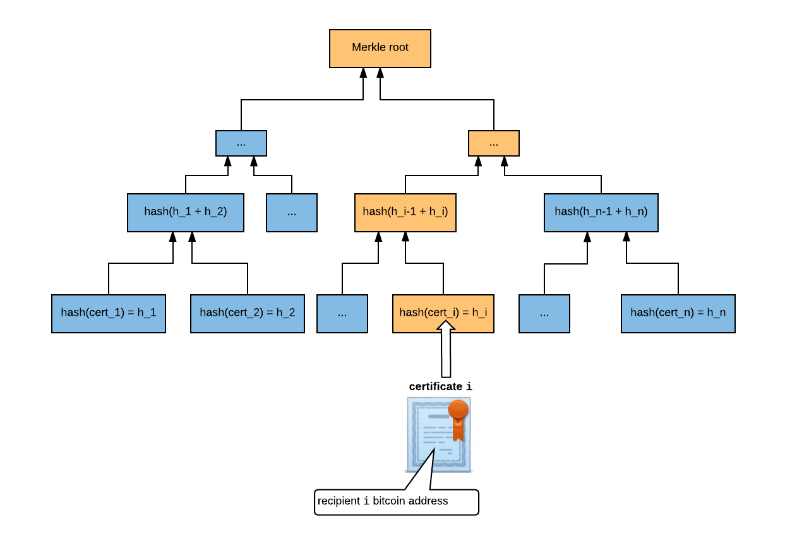

[](https://travis-ci.org/blockchain-certificates/cert-issuer)
[](https://badge.fury.io/py/cert-issuer)


# cert-issuer

The cert-issuer project issues blockchain certificates by creating a transaction from the issuing institution to the
recipient on the Bitcoin blockchain that includes the hash of the certificate itself. 

## Quick start using Docker

This uses bitcoind in regtest mode. This route makes many simplifications to allow a quick start, and is intended for
experimenting only.

1. First ensure you have Docker installed. [See our Docker installation help](docs/docker_install.md).

2. Clone the repo and change to the directory

    ```
    git clone https://github.com/blockchain-certificates/cert-issuer.git && cd cert-issuer
    ```


3. From a command line in cert-issuer dir, build your docker container:
    
    ```
    docker build -t bc/cert-issuer:1.0 .
    ```

4. Read before running!

    - Once you launch the docker container, you will make some changes using your personal issuing information. This flow mirrors what you would if you were issuing real certificates.
    - To avoid losing your work, you should create snapshots of your docker container. You can do this by running:

        ```
        docker ps -l
        docker commit <container for your bc/cert-issuer> my_cert_issuer
        ```

5. When you're ready to run:

    ```
    docker run -it bc/cert-issuer:1.0 bash
    ```

## Create issuing address

__Important__: this is a simplification to avoid using a USB, which needs to be inserted and removed during the
standard certficate issuing process. Do not use these addresses or private keys for anything other than experimenting.

Ensure your docker image is running and bitcoind process is started

1. Create an 'issuing address' and save the output as follows:

    ```
    issuer=`bitcoin-cli getnewaddress`
    sed -i.bak "s/<issuing-address>/$issuer/g" /etc/cert-issuer/conf.ini
    bitcoin-cli dumpprivkey $issuer > /etc/cert-issuer/pk_issuer.txt
    ```
    
2. Don't forget to save snapshots so you don't lose your work (see step 3 of client setup)

## Issuing certificates

1. Add your certificate to /etc/cert-issuer/data/unsigned_certificates/. 

    ```
    # To use a sample unsigned certificate as follows:
    cp /cert-issuer/examples/data-testnet/unsigned_certificates/13a58c4a-f49f-4b63-9c82-125b944f5dfb.json /etc/cert-issuer/data/unsigned_certificates/ 
    
    # If you created your own unsigned certificate using cert-tools (assuming you placed it under data/unsigned_certificates):
    cp <cert-issuer-home>/data/unsigned_certificates/<your-cert-guid>.json /etc/cert-issuer/data/unsigned_certificates/
    ```

2. Make sure you have enough BTC in your issuing address.

    a. You're using bitcoind in regtest mode, so you can print money. This should give you 50 (fake) BTC:

    ```
    bitcoin-cli generate 101
    bitcoin-cli getbalance
    ```

    b. Send the money to your issuing address -- note that bitcoin-cli's standard denomination is bitcoins not satoshis! (In our
    app, the standard unit is satoshis.) This command sends 5 bitcoins to the address

    ```
    bitcoin-cli sendtoaddress $issuer 5
    ```

3. Issue the certificates on the blockchain

    ```
    cert-issuer -c /etc/cert-issuer/conf.ini
    ```
    
4. Your Blockchain certificates are located in `/etc/cert-issuer/data/blockchain_certificates`. Copy these to your local machine, and add them to cert-viewer's `cert_data` folder to see your certificates in the Certificate Viewer.

```
docker ps  // shows the docker containerId
docker cp <containerId>:/etc/cert-issuer/data/blockchain_certificates <localPath>/cert-viewer/cert_data
```

## Unit tests

This project uses tox to validate against several python environments.

1. Ensure you have an python environment. [Recommendations](docs/virtualenv.md)

2. Run tests
    ```
    ./run_tests.sh
    ```

## Issuing options

The quick start instructions use a test mode for issuing certificates. Most of the steps apply for issuing certificates on the real Bitcoin blockchain. Read [Certificate Issuing Options](docs/bitcoin_options.md) for an overview of issuing options.


## How batch issuing works

While it is possible to issue one certificate with one Bitcoin transaction, it is far more efficient to use one Bitcoin transaction to issue a batch of certificates. 

The issuer builds a Merkle tree of certificate hashes and registers the Merkle root as the OP_RETURN field in the Bitcoin transaction. 

Suppose the batch contains `n` certificates, and certificate `i` contains recipient `i`'s information. The issuer hashes each certificate and combines them into a Merkle tree:




The root of the Merkle tree, which is a 256-bit hash, is issued on the Bitcoin blockchain. The complete Bitcoin transaction outputs are described in 'Transaction structure'.

The Blockchain Certificate given to recipient `i` contains a [Chainpoint V2-formatted Merkle receipt](https://github.com/chainpoint/whitepaper/raw/master/chainpoint_white_paper.pdf) proving that certificate `i` is contained in the Merkle tree. 


This receipt contains:

*   The Bitcoin transaction ID storing the Merkle root
*   The expected Merkle root on the blockchain
*   The expected hash for recipient `i`'s certificate
*   The Merkle path from recipient `i`'s certificate to the Merkle root, i.e. the path highlighted in orange above. `h_i -> … -> Merkle root`

The [verification process](https://github.com/blockchain-certificates/cert-verifier-js#verification-process) performs computations to check that:

*   The hash of certificate `i` matches the value in the receipt
*   The Merkle path is valid
*   The Merkle root stored on the blockchain matches the value in the receipt

These steps establish that the certificate has not been tampered with since it was issued.

### Hashing a certificate

The Blockchain Certificate JSON contents without the `signature` node is the certificate that the issuer created. This is the value needed to hash for comparison against the receipt. Because there are no guarantees about ordering or formatting of JSON, first canonicalize the certificate (without the `signature`) against the JSON LD schema. This allows us to obtain a deterministic hash across platforms.

The detailed steps are described in the [verification process](https://github.com/blockchain-certificates/cert-verifier-js#verification-process).


### What should be in a batch?

How a batch is defined can vary, but it should be defined such that it changes infrequently. For example, “2016 MIT grads” would be preferred over “MIT grads” (the latter would have to be updated every year). The size of the batch is limited by the 100KB maximum transaction size imposed by the Bitcoin network. This will amount to a maximum of around 2,000 recipients per certificate batch.

### Transaction structure


One Bitcoin transaction is performed for every batch of certificates. There is no limit to the number of certificates that may be included in a batch, so typically batches are defined in logical groups such as "Graduates of Fall 2017 Robotics Class".


The transaction structure is the following:

*   Input:
    *    Minimal amount of bitcoin (currently ~$.80 USD) from Issuer's Bitcoin address
*   Outputs:
    *   OP_RETURN field, storing a hash of the batch of certificates
    *   Optional: change to an issuer address

The OP_RETURN output is used to prove the validity of the certificate batch. This output stores data, which is the hash of the Merkle root of the certificate batch. At any time, we can look up this value on the blockchain to help confirm a claim.

The Issuer Bitcoin address and timestamp from the transaction are also critical for the verification process. These are used to check the authenticity of the claim, as described in [verification process](https://github.com/blockchain-certificates/cert-verifier-js#verification-process).


## Advanced Docs

- [Issuing options](docs/bitcoin_options.md)
- [Creating addresses](docs/make_addresses.md)
- [Issuing certificates](docs/issuing.md)

## Examples

The files in examples/data-testnet and examples/data-mainnet contain results of previous runs. 

## Checking transaction status

You can validate your transaction before sending by looking it up by rawtx at blockchain.info. Example:

   ```
   curl 'https://blockchain.info/rawtx/45a9306dfe99820eb346bb17ae0b64173ac11cac2d0e4227c7a7cacbcc0bad31?cors=true'
   ```

## Contact

Contact [info@blockcerts.org](mailto:info@blockcerts.org) with questions


