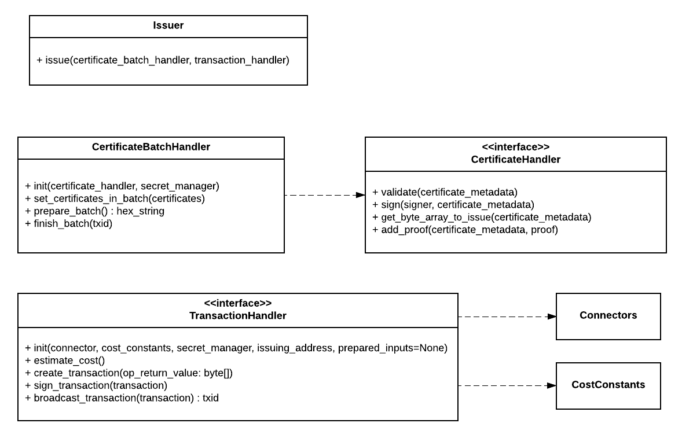
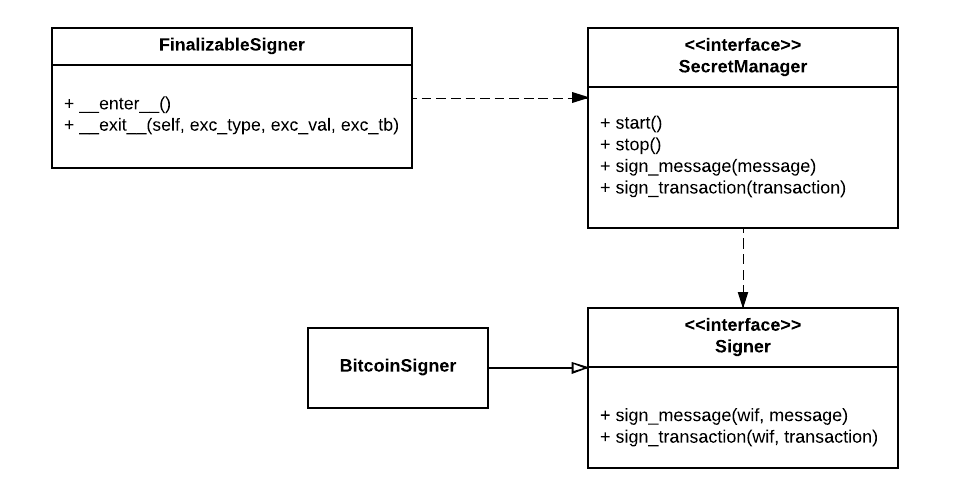
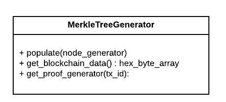

# Contributing to cert-issuer

Information about class structure and unit testing can be found below for those wishing to contribute to this codebase. 

# Class design

## Core issuing classes


The `Issuer` api is quite simple; it relies on `CertificateHandler`s and `Transaction Handler`s to do the work of 
extracting the data to issue on the blockchain, and handling the blockchain transaction, respectively.

`CertificateBatchHandler` manages the certificates to issue on the blockchain. It ensures that all accessors iterate
 certificates in a predictable order. This is critical because the Merkle Proofs must be associated with the correct
 certificate. Python generators are used here to help keep the memory footprint low while reading from files.

- `prepare_batch` 
    - performs the preparatory steps on certificates in the batch, including validation of the schema and forming the 
    data that will go on the blockchain. Certificate-level details are handled by `CertificateHandler`s
    - returns the hex byte array that will go on the blockchain
- `finish_batch` ensures each certificate is updated with the blockchain transaction information (and proof in general)

`CertificateHandler` is responsible for reading from and updating a specific certificate (identified by certificate_metadata). 
It is used exclusively by `CertificateBatchHandler` to handle certificate-level details:
- `validate`: ensure the certificate is well-formed
- `sign`: (currently unused)
- `get_byte_array_to_issue`: return byte array that will be hashed, hex-digested and added to the Merkle Tree
- `add_proof`: associate a a proof with a certificate (in the current implementation, the proof is embedded in the file)

`TransactionHandler` deals with putting the data on the blockchain. Currently only a Bitcoin implementation exists

## Signing and secret management



Finalizable signer is a convenience class allowing use of python's `with` syntax. E.g.:

```

with FinalizableSigner(secret_manager) as fs:
    fs.sign_message(message_to_sign)

```

SecretManagers ensure the secret key (wif) is loaded into memory for signing. FileSecretManager is the only current
implemenation.

## Merkle tree generator



Handles forming the Merkle Tree, returning the data to put on the blockchain, and returning a python generator of the
proofs.

This class structure is intended to be general-purpose to allow other implementations. (Do this carefully if at all.)

# Unit tests

This project uses tox to validate against several python environments.

1. Ensure you have an python environment. [Recommendations](../docs/virtualenv.md)

2. Run tests
    ```
    ./run_tests.sh
    ```
   
# Publishing To Pypi
- Create an account for [pypi](https://pypi.org) & [pypi test](https://test.pypi.org)
- Install [twine](github.com/pypa/twine) - `pip install twine`
- Increment version in `__init__.py`
- Remove current items in dist - `rm -rf dist/*`
- Build cert-issuer - `python setup.py install`
- Build sdist - `python setup.py sdist`
- Run pypi test upload - `twine upload --repository-url https://test.pypi.org/legacy/ dist/*`
- Upload to pypi - `twine upload --repository-url https://upload.pypi.org/legacy/ dist/*`