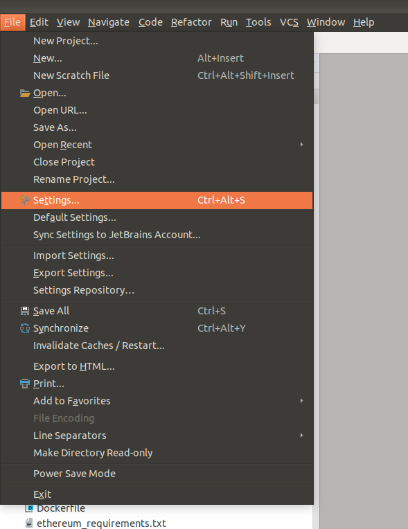
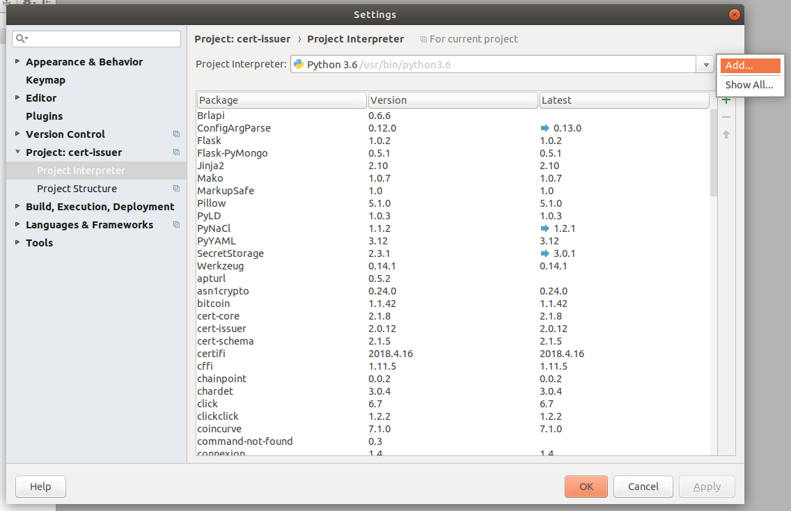
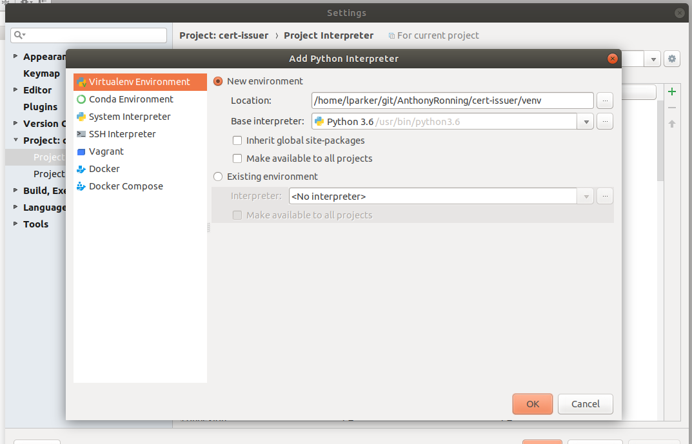
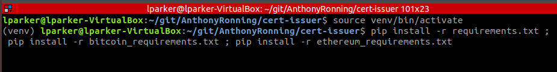
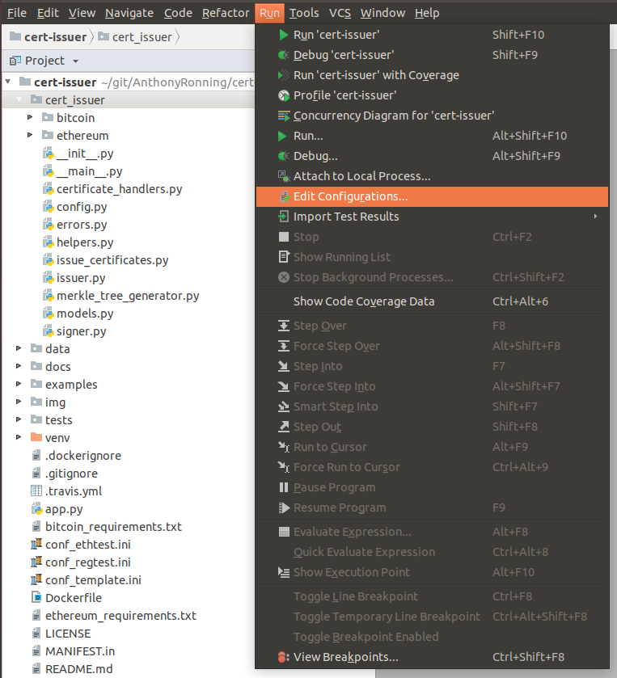
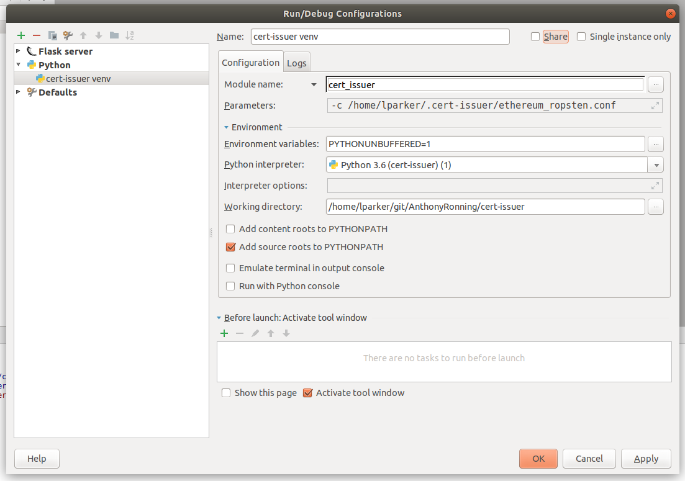

# Getting cert-issuer running in PyCharm

Note that cert-issuer might not currently run in Windows due to an issue with libssl.  The following steps assume a Linux installation.

1. Clone the project repo.

2. Open the directory in PyCharm, which should get you into the IDE proper.

3. Go to File -> Settings...



4. Go to the Project Interpreter screen, click the little gear icon and select Add...


5. Make sure you're adding a virtual environment, and click OK.


6. In a bash terminal, make sure your present working directory is the root of the project.  Activate the virtual environment, and install all of the project requirements.
```bash
source venv/bin/activate
pip install -r requirements.txt ; pip install -r bitcoin_requirements.txt ; pip install -r ethereum_requirements.txt
```


7. Go to Run -> Edit Configurations...


8. In the run configuration menu, press the little green plus sign toward the upper left corner and select `Python` from way down in the list.  Click the "Script name" dropdown and change it to "Module name."  Enter `cert_issuer` for the module name (you should see tab completion pop up).  Give it your command line argument for your config file.  Make sure that "Add source roots to PYTHONPATH" is selected.  Click OK to move on.


9. Go to Run... -> Run... (or Debug...) and you should be good to go.